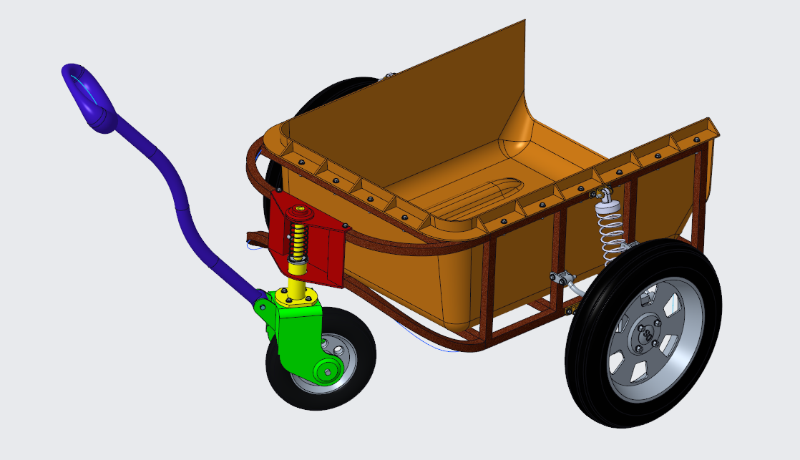
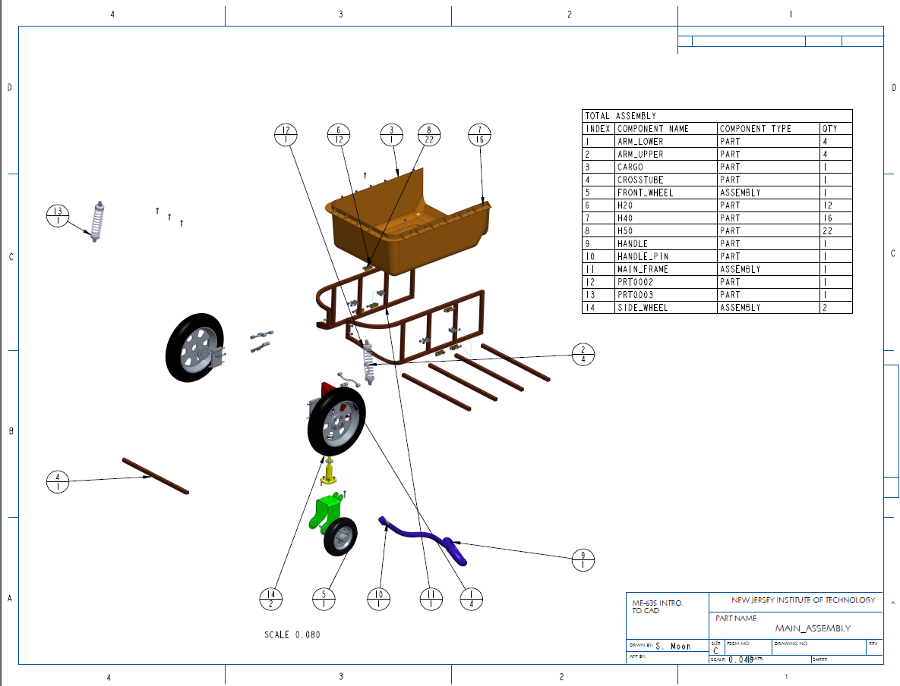

# Deeptha Sabarish
Mechanical and Mechatronics Engineer
Manufacturing | Embedded Systems | Product Development

Welcome to my engineering portfolio. This repository documents hands-on mechanical and mechatronics projects focused on real-world system design, manufacturing integration, and embedded control.

---

## Engineering Focus Areas

- Mechanical Design & CAD (SolidWorks, DFM, GD&T)
- Manufacturing & Tooling Development
- Embedded Systems & Microcontrollers
- Sensors & Actuators Integration
- Control Systems & System Validation

---

## Designs

Cart Project
An exercise to get comfortable with both SolidWorks and CREO
|   |   |
