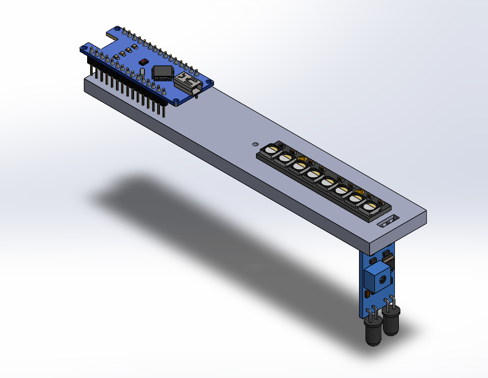
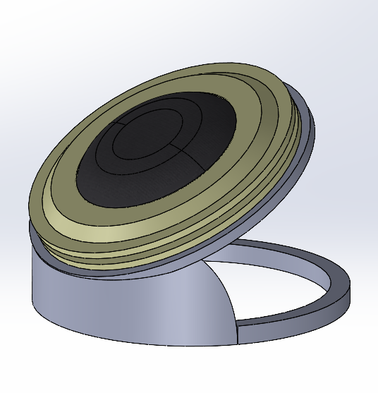

# Deeptha Sabarish
Mechanical and Mechatronics Engineer
Manufacturing | Embedded Systems | Product Development

Welcome to my engineering portfolio. This repository documents hands-on mechanical and mechatronics projects focused on real-world system design, manufacturing integration, and embedded control.

---

## Engineering Focus Areas

- Mechanical Design & CAD (SolidWorks, DFM, GD&T)
- Manufacturing & Tooling Development
- Embedded Systems & Microcontrollers
- Sensors & Actuators Integration
- Control Systems & System Validation

---

## Projects and Prototypes

### Real time gesture recognition system using triple channel custom EMG sensors using signal processing algorithms.

[Download Gesture_Recognition Video](Gesture_Recognition.mp4)
This project could extend into a prodcut to monitor physical health to avoid injuries caused by physical movement. This started off as an aid to record choreographies for classical dance and then the idea evolved into a personal project.

### Persistence of Vision
[Download Persistence_of_Vision Video](Persistence_of_Vision.mp4)

A project that involves using a mictrocontroller -Arduino Nano- controlling both LED strip and the DC motor to form static imaging. 

### Peristaltic Pump Prototype

This was a reverse engineered and developed to for ease of manufacturing and application.

### Valve automation

---

## CAD

Cart Project
An exercise to get comfortable with both SolidWorks and CREO
  
 

Speaker mount

